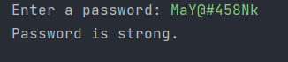

# Password_checker

# Password Checker Program in Python by Mayank Mali

The Password Checker Program in Python by Mayank Mali is a tool designed to evaluate the strength of user passwords. This program takes user input for a password and then checks its strength based on certain criteria such as the length of the password, whether it contains uppercase and lowercase letters, numbers, and special characters.

## Features

- Checks the strength of user passwords
- Evaluates password strength based on certain criteria
- Provides suggestions to improve password strength
- Generates strong passwords automatically
- Lightweight and user-friendly
- Well-documented code with comments

## Usage

To use the Password Checker Program in Python by Mayank Mali, simply run the Python script on any system with Python installed. The program will prompt the user to enter a password and will then evaluate its strength based on the specified criteria. The program will then return a message indicating whether the password is weak, moderate or strong, along with suggestions for how the user can improve the password strength. 

## Modification

The code is well-documented with comments explaining the purpose of each section and how it works. This makes it easy for other developers to understand and modify the code as per their requirements. 

## Conclusion

In conclusion, the Password Checker Program in Python by Mayank Mali is a useful tool for anyone looking to improve the security of their passwords and protect their personal or sensitive data from unauthorized access.
